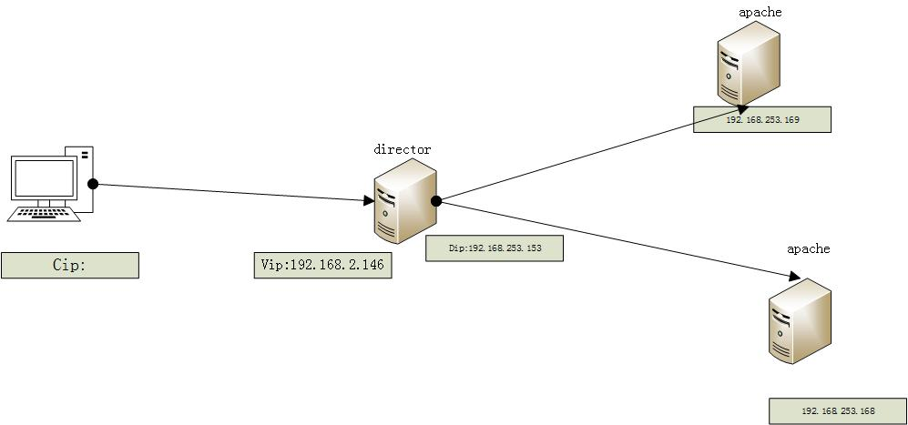

 **lvs-nat的简单实现**

实验拓扑如下图： 



如图所示lvs-nat实现对后端2台real server（搭建apache httpd服务）进行负载均衡。

step1：

```
    1、按照拓扑所示配置好IP地址
    2、director需要准备两块网卡（一块公网网卡配置vip，一块内网网卡配置dip）
    3、后端两台real server准备一块网卡（内网网卡）配置rip，注意网关需要指向dip
```

step2各节点网络设置如下：

```
以下是director上的配置：

[root@localhost ~]# ip addr
1: lo: <LOOPBACK,UP,LOWER_UP> mtu 65536 qdisc noqueue state UNKNOWN 
    link/loopback 00:00:00:00:00:00 brd 00:00:00:00:00:00
    inet 127.0.0.1/8 scope host lo
       valid_lft forever preferred_lft forever
    inet6 ::1/128 scope host 
       valid_lft forever preferred_lft forever
2: eno16777736: <BROADCAST,MULTICAST,UP,LOWER_UP> mtu 1500 qdisc pfifo_fast state UP qlen 1000
    link/ether 00:0c:29:37:63:02 brd ff:ff:ff:ff:ff:ff
    inet 192.168.2.146/24 brd 192.168.2.255 scope global dynamic eno16777736
       valid_lft 4229sec preferred_lft 4229sec
    inet6 fe80::20c:29ff:fe37:6302/64 scope link 
       valid_lft forever preferred_lft forever
3: eno33554984: <BROADCAST,MULTICAST,UP,LOWER_UP> mtu 1500 qdisc pfifo_fast state UP qlen 1000
    link/ether 00:0c:29:37:63:0c brd ff:ff:ff:ff:ff:ff
    inet 192.168.253.153/24 brd 192.168.253.255 scope global eno33554984
       valid_lft forever preferred_lft forever
    inet6 fe80::20c:29ff:fe37:630c/64 scope link 
       valid_lft forever preferred_lft forever
[root@localhost ~]# cat /etc/sysconfig/network-scripts/ifcfg-eno16777736 
TYPE="Ethernet"
BOOTPROTO="static"
IPADDR=192.168.2.146
NETMASK=255.255.255.0
DEFROUTE="yes"
PEERDNS="yes"
PEERROUTES="yes"
IPV4_FAILURE_FATAL="no"
IPV6INIT="yes"
IPV6_AUTOCONF="yes"
IPV6_DEFROUTE="yes"
IPV6_PEERDNS="yes"
IPV6_PEERROUTES="yes"
IPV6_FAILURE_FATAL="no"
NAME="eno16777736"
UUID="ee2e45b1-4b9c-41cb-8507-de93e3827896"
DEVICE="eno16777736"
ONBOOT="yes"
[root@localhost ~]# cat /etc/sysconfig/network-scripts/ifcfg-eno33554984 
TYPE="Ethernet"
BOOTPROTO="static"
IPADDR=192.168.253.153
NETMASK=255.255.255.0
DEFROUTE="yes"
PEERDNS="yes"
PEERROUTES="yes"
IPV4_FAILURE_FATAL="no"
IPV6INIT="yes"
IPV6_AUTOCONF="yes"
IPV6_DEFROUTE="yes"
IPV6_PEERDNS="yes"
IPV6_PEERROUTES="yes"
IPV6_FAILURE_FATAL="no"
NAME="eno33554984"
DEVICE="eno33554984"
ONBOOT="yes"
```

以下是rs1、和rs2的配置： 

[](http://static.zybuluo.com/desperadousa/bw342ydsnbwgv4nhnbrwr6h2/QQ图片20161211224831.png)


[](http://static.zybuluo.com/desperadousa/ia23tpa2dojd2xgsq9fdvpkt/QQ图片20161211225106.png)


 注意real server的网关要指向dip

------

step3在real server上进行如下操作：

```
以下是real server1上进行的操作:
# yum install httpd -y &> /dev/null && echo success || echo failure    #RS1安装httpd
success #安装成功
#route add default gw 192.168.253.153  #设置默认网关为Director的DIP
# echo "<h1>This is Real Server 1 </h1>" > /var/www/html/index.html   #添加测试网页
#systemctl start httpd #启动httpd服务

以下是real server2上进行的操作:
# yum install httpd -y &> /dev/null && echo success || echo failure    #RS1安装httpd
success #安装成功
#route add default gw 192.168.253.153  #设置默认网关为Director的DIP
# echo "<h1>This is Real Server 2 </h1>" > /var/www/html/index.html #添加测试网页
#systemctl start httpd #启动httpd服务
```

step4在director上进行操作：

```
# yum install ipvsadm -y   #安装ipvsadm
[root@localhost ~]#  curl 192.168.253.169   #测试rs是否可以服务
<h1>This is Real Server 1 </h1>
[root@localhost ~]#  curl 192.168.253.168  #测试rs是否可以服务
<h1>This is Real Server 2 </h1>
[root@localhost ~]#  vim /etc/sysctl.conf   #编辑内核文件开启内核路由转发

# System default settings live in /usr/lib/sysctl.d/00-system.conf.
# To override those settings, enter new settings here, or in an /etc/sysctl.d/<name>.conf file
#
# For more information, see sysctl.conf(5) and sysctl.d(5).
net.ipv4.ip_forward = 1  #添加该项设置
[root@localhost ~]# sysctl -p  #对刚才的修改进行立即生效
net.ipv4.ip_forward = 1  #可见已经生效
[root@localhost ~]#  cat /proc/sys/net/ipv4/ip_forward  #查看是否开启路由转发功能
1  #开启
[root@localhost ~]# ipvsadm -A -t 192.168.2.146:80 -s rr
[root@localhost ~]# ipvsadm -a -t 192.168.2.146:80 -r 192.168.253.169 -m
[root@localhost ~]# ipvsadm -a -t 192.168.2.146:80 -r 192.168.253.168 -m
[root@localhost ~]#  ipvsadm -Ln  #查看规则
IP Virtual Server version 1.2.1 (size=4096)
Prot LocalAddress:Port Scheduler Flags
  -> RemoteAddress:Port           Forward Weight ActiveConn InActConn
TCP  192.168.2.146:80 rr
  -> 192.168.253.168:80           Masq    1      0          0         
  -> 192.168.253.169:80           Masq    1      0          0 
[root@localhost ~]#  curl http://192.168.2.146
<h1>This is Real Server 2 </h1>
[root@localhost ~]#  curl http://192.168.2.146
<h1>This is Real Server 1 </h1>
```

测试： 

  

 

## **踩过的坑**

在实验过程中遇到了浏览器访问vip失败，但是director上curlvip却可以的情况后来排查发现real server开启了两块网卡（一块外网，一块内网，浏览器可以通过外网ip访问real server上的web服务），当我只启用了内网网卡时，浏览器成功访问vip。 
因此当你实验失败时请从以下两点排查： 
    1、real server是否启用了多块网卡，如果是请禁用多余的 只启用内网网卡。并且把网关指向dip 
    2 、关闭iptables和selinux（或者设置合适的规则）

