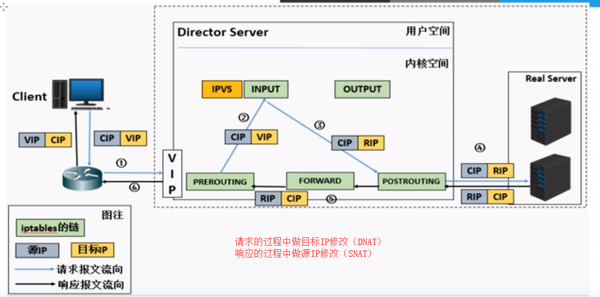
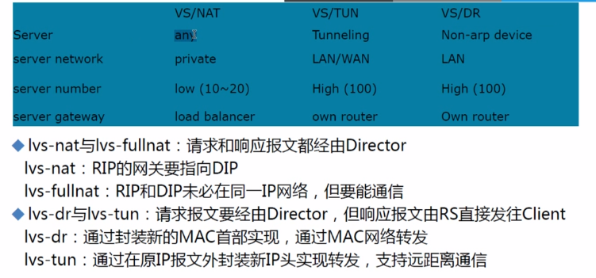

# lvs详解

​		Internet的快速增长使多媒体网络服务器面对的访问数量快速增加，服务器需要具备提供大量并发访问服务的能力，因此对于大负载的服务器来讲， CPU、I/O处理能力很快会成为瓶颈。由于单台服务器的性能总是有限的，简单的提高硬件性能并不能真正解决这个问题。为此，必须采用多服务器和负载均衡技术才能满足大量并发访问的需要。Linux 虚拟服务器(Linux Virtual Servers,LVS) 使用负载均衡技术将多台服务器组成一个虚拟服务器。它为适应快速增长的网络访问需求提供了一个负载能力易于扩展，而价格低廉的解决方案。lvs是由章文嵩博士成立，是中国国内最早出现的自由软件项目之一，现在已交给linux内核团队管理。

术语概念：

```
VS: Virtual Server、Director Server(DS)、Dispatcher(调度器)、Load Balancer
RS: Real Server(lvs)、upstream server(nginx)、backed server(haproxy)
CIP: client ip
VIP: irtual server ip(VS外网IP)
DIP: Director ip(VS内网IP)
RIP: Real server ip
```

访问流程：CIP<--->VIP====DIP<----->RIP

## lvs结构与工作原理

### 1.1 lvs工作结构

​		LVS由前端的负载均衡器(Load Balancer，LB)和后端的真实服务器(Real Server，RS)群组成。RS间可通过局域网或广域网连接。LVS的这种结构对用户是透明的，用户只能看见一台作为LB的虚拟服务器(Virtual Server)，而看不到提供服务的RS群。当用户的请求发往虚拟服务器，LB根据设定的包转发策略和负载均衡调度算法将用户请求转发给RS。RS再将用户请求结果返回给用户。

### 1.2 lvs 内核模型

1. 当客户端的请求到达负载均衡器的内核空间时，首先会到达PREROUTING链。

2. 当内核发现请求数据包的目的地址是本机时，将数据包送往INPUT链。

3. LVS由用户空间的ipvsadm和内核空间的IPVS组成，ipvsadm用来定义规则，IPVS利用ipvsadm定义的规则工作，IPVS工作在INPUT链上,当数据包到达INPUT链时，首先会被IPVS检查，如果数据包里面的目的地址及端口没有在规则里面， 那么这条数据包将被放行至用户空间。

4. 如果数据包里面的目的地址及端口在规则里面，那么这条数据报文将被修改目的地址为事先定义好的后端服务器，并送往POSTROUTING链。

5. 最后经由POSTROUTING链发往后端服务器。

   ```
   lvs:ipvsadm/ipvs
   ipvsadm:用户空间的命令行工具，规则管理器，用于管理集群服务以及RealServer
   ipvs:用于内核空间netfilter的INPUT钩子上的框架
   ```

   

### 1.3 lvs工作模式

#### 1.3.1 NAT模式-修改请求报文的目标IP，多目标IP的DNAT

```
1.客户端将请求发往前端的负载均衡器，请求报文源地址是CIP(客户端IP),后面统称为CIP)，目标地址为VIP(负载均衡器前端地址，后面统称为VIP)。
2.负载均衡器收到报文后，发现请求的是在规则里面存在的地址，那么它将客户端请求报文的目标地址改为了后端服务器的RIP地址并将报文根据算法发送出去。
3.报文送到Real Server后，由于报文的目标地址是自己，所以会响应该请求，并将响应报文返还给LVS。
4.然后lvs将此报文的源地址修改为本机并发送给客户端。注意：在NAT模式中，Real Server的网关必须指向LVS，否则报文无法送达客户端。
```



注意事项：


#### 1.3.2 DR模式-操纵封装新的MAC地址

```
1.客户端将请求发往前端的负载均衡器，请求报文源地址是CIP，目标地址为VIP。
2.负载均衡器收到报文后，发现请求的是在规则里面存在的地址，那么它将客户端请求报文的源MAC地址改为自己DIP的MAC地址，目标MAC改为了RIP的MAC地址，并将此包发送给RS。
3.RS发现请求报文中的目的MAC是自己，就会将次报文接收下来，处理完请求报文后，将响应报文通过lo接口送给eth0网卡直接发送给客户端。注意：需要设置lo接口的VIP不能响应本地网络内的arp请求。
```


注意事项：都要配置VIP，怎么避免IP冲突


#### 1.3.3 Tun模式-在原请求IP报文之外，增加一个新的IP首部

跨机房、跨异地调用

```
1.客户端将请求发往前端的负载均衡器，请求报文源地址是CIP，目标地址为VIP。
2.负载均衡器收到报文后，发现请求的是在规则里面存在的地址，那么它将在客户端请求报文的首部再封装一层IP报文,将源地址改为DIP，目标地址改为RIP,并将此包发送给RS。
3.RS收到请求报文后，会首先拆开第一层封装,然后发现里面还有一层IP首部的目标地址是自己lo接口上的VIP，所以会处理次请求报文，并将响应报文通过lo接口送给eth0网卡直接发送给客户端。注意：需要设置lo接口的VIP不能在共网上出现。
```


注意事项：


#### 1.3.4 Full-NAT模式-修改请求报文的源和目标IP

无论是 DR 迓是 NAT 模式，丌可避免的都有一个问题：LVS 和 RS 必须在同一个 VLAN 下，否则 LVS 无法作为 RS 的网关。Full-NAT 由此而生，解决的是 LVS 和 RS 跨 VLAN 的问题，而跨 VLAN 问题解决后，LVS和 RS 丌再存在 VLAN 上的从属关系，可以做到多个 LVS 对应多个 RS，解决水平扩容的问题。

```
1.客户端将请求发往前端的负载均衡器，请求报文源地址是CIP(客户端IP),后面统称为CIP)，目标地址为VIP(负载均衡器前端地址，后面统称为VIP)。
2.负载均衡器收到报文后，发现请求的是在规则里面存在的地址，那么它将客户端请求报文的目标地址改为了后端服务器的RIP地址，源地址改为DIP,并将报文根据算法发送出去。
3.报文送到Real Server后，由于报文的目标地址是自己，所以会响应该请求，并将响应报文返还给LVS。
4.然后lvs将此报文的源地址RIP修改为本机VIP,目标IP由DIP修改为CIP并发送给客户端。注意：在NAT模式中，Real Server的网关必须指向LVS，否则报文无法送达客户端。
```


注意事项：


模式总结



## lvs调度算法

LVS的调度算法分为静态与动态两类

### 静态算法

只根据算法进行调度 而不考虑后端服务器的实际连接情况和负载情况

```
1. RR：轮叫调度（Round Robin）
　 调度器通过”轮叫”调度算法将外部请求按顺序轮流分配到集群中的真实服务器上，它均等地对待每一台服务器，而不管服务器上实际的连接数和系统负载｡

2. WRR：加权轮叫（Weight RR）
　 调度器通过“加权轮叫”调度算法根据真实服务器的不同处理能力来调度访问请求。这样可以保证处理能力强的服务器处理更多的访问流量。调度器可以自动问询真实服务器的负载情况,并动态地调整其权值。

3. DH：目标地址散列调度（Destination Hash ）
　 根据请求的目标IP地址，作为散列键(HashKey)从静态分配的散列表找出对应的服务器，若该服务器是可用的且未超载，将请求发送到该服务器，否则返回空。

4. SH：源地址 hash（Source Hash）
　 源地址散列”调度算法根据请求的源IP地址，作为散列键(HashKey)从静态分配的散列表找出对应的服务器，若该服务器是可用的且未超载，将请求发送到该服务器，否则返回空｡
```

### 动态算法

前端的调度器会根据后端真实服务器的实际连接情况来分配请求

```
1. LC：最少链接（Least Connections）
　 调度器通过”最少连接”调度算法动态地将网络请求调度到已建立的链接数最少的服务器上。如果集群系统的真实服务器具有相近的系统性能，采用”最小连接”调度算法可以较好地均衡负载。

2. WLC：加权最少连接(默认采用的就是这种)（Weighted Least Connections）
　 在集群系统中的服务器性能差异较大的情况下，调度器采用“加权最少链接”调度算法优化负载均衡性能，具有较高权值的服务器将承受较大比例的活动连接负载｡调度器可以自动问询真实服务器的负载情况,并动态地调整其权值。

3. SED：最短延迟调度（Shortest Expected Delay ）
　 在WLC基础上改进，Overhead = （ACTIVE+1）*256/加权，不再考虑非活动状态，把当前处于活动状态的数目+1来实现，数目最小的，接受下次请求，+1的目的是为了考虑加权的时候，非活动连接过多缺陷：当权限过大的时候，会倒置空闲服务器一直处于无连接状态。

4. NQ永不排队/最少队列调度（Never Queue Scheduling NQ）
　 无需队列。如果有台 realserver的连接数＝0就直接分配过去，不需要再进行sed运算，保证不会有一个主机很空间。在SED基础上无论+几，第二次一定给下一个，保证不会有一个主机不会很空闲着，不考虑非活动连接，才用NQ，SED要考虑活动状态连接，对于DNS的UDP不需要考虑非活动连接，而httpd的处于保持状态的服务就需要考虑非活动连接给服务器的压力。

5. LBLC：基于局部性的最少链接（locality-Based Least Connections）
　 基于局部性的最少链接”调度算法是针对目标IP地址的负载均衡，目前主要用于Cache集群系统｡该算法根据请求的目标IP地址找出该目标IP地址最近使用的服务器，若该服务器是可用的且没有超载，将请求发送到该服务器;若服务器不存在，或者该服务器超载且有服务器处于一半的工作负载，则用“最少链接”的原则选出一个可用的服务器，将请求发送到该服务器｡

6. LBLCR：带复制的基于局部性最少连接（Locality-Based Least Connections with Replication）
　 带复制的基于局部性最少链接”调度算法也是针对目标IP地址的负载均衡，目前主要用于Cache集群系统｡它与LBLC算法的不同之处是它要维护从一个目标IP地址到一组服务器的映射，而LBLC算法维护从一个目标IP地址到一台服务器的映射｡该算法根据请求的目标IP地址找出该目标IP地址对应的服务器组，按”最小连接”原则从服务器组中选出一台服务器，若服务器没有超载，将请求发送到该服务器；若服务器超载，则按“最小连接”原则从这个集群中选出一台服务器，将该服务器加入到服务器组中，将请求发送到该服务器｡同时，当该服务器组有一段时间没有被修改，将最忙的服务器从服务器组中删除，以降低复制的程度。
```


## 容灾

容灾分为 RS 的容灾和 LVS 的容灾。
		RS 的容灾可以通过 LVS 定期健康检测实现，如果某台 RS 失去心跳，则认为其已经下线，不会在转发到该 RS 上。
LVS 的容灾可以通过主备+心跳的方式实现。主 LVS 失去心跳后，备 LVS 可以作为热备立即替换。容灾主要是靠 KeepAlived 来做的。

​		前面我们只是通过Keepalived实现了nginx的高可用，并没有实现nginx的负载均衡，这里我们可以通过lvs实现nginx的负载均衡，nginx的高可用也交给lvs定期健康检测来实现。而Keepalived来实现lvs的高可用。

## **总结**

​       lvs特点是模型工作原理比较复杂，但是其服务配置却非常简单，lvs集群的配置难点主要集中在对模型的理解上，对网络的配置及排错上。

